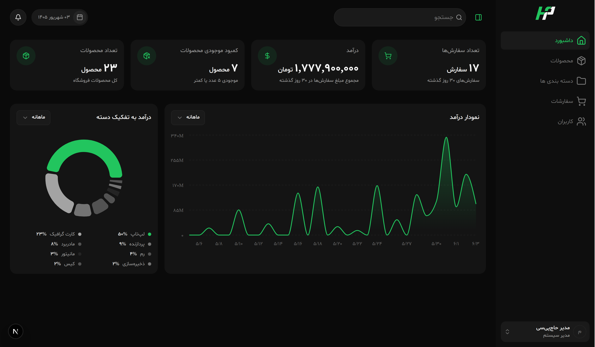

<div align="center">

# Haj PC

**Admin platform for a PC hardware store** — catalog, orders, users, and live store analytics in one Turborepo.

<br />


<br />



<p><em>Dark admin dashboard — KPIs, revenue by category, and 30-day order trends.</em></p>

</div>

---

## What it is

Haj PC is a monorepo for running a PC parts shop from the back office: products and images, categories, orders, staff users, and a dashboard that actually reflects the store.

| App | Path | Role |
| --- | --- | --- |
| **Web** | [`apps/web`](apps/web) | Next.js admin UI (RTL, dark theme) |
| **API** | [`apps/api`](apps/api) | NestJS REST API, JWT auth, Prisma, storage |
| **Types** | [`packages/types`](packages/types) | Shared TypeScript contracts |

## Stack

```
haj-pc/
├── apps/
│   ├── web/          Next.js 16 · React 19 · Tailwind · TanStack Query
│   └── api/          NestJS 11 · Prisma · PostgreSQL · Supabase Storage
├── packages/
│   ├── types/        Shared entities (product, order, user, …)
│   ├── eslint-config/
│   └── typescript-config/
└── screenshots/
```

## Quick start

**Requirements:** Node.js 18+, [pnpm](https://pnpm.io) 11.

```bash
pnpm install
cp apps/api/.env.example apps/api/.env
cp apps/web/.env.example apps/web/.env.local   # if you keep a local copy
```

Fill `apps/api/.env` (`DATABASE_URL`, `JWT_SECRET`, `FRONTEND_URL`, Supabase keys). Web talks to the API through `API_URL` (default `http://localhost:7700`).

```bash
pnpm dev
```

| Service | URL |
| --- | --- |
| Admin | [http://localhost:3000](http://localhost:3000) |
| API | [http://localhost:7700/api](http://localhost:7700/api) |
| Scalar docs | [http://localhost:7700/api/docs/scalar](http://localhost:7700/api/docs/scalar) |
| Swagger | [http://localhost:7700/api/docs/swagger](http://localhost:7700/api/docs/swagger) |

Root `/` sends you to sign-in, then `/admin/dashboard`.

### Useful commands

```bash
pnpm dev                 # all apps
pnpm build               # all apps
pnpm lint
pnpm check-types
pnpm --filter web dev    # frontend only
pnpm --filter api dev    # backend only
```

## Docs

- [Frontend](apps/web/README.md)
- [Backend](apps/api/README.md)
